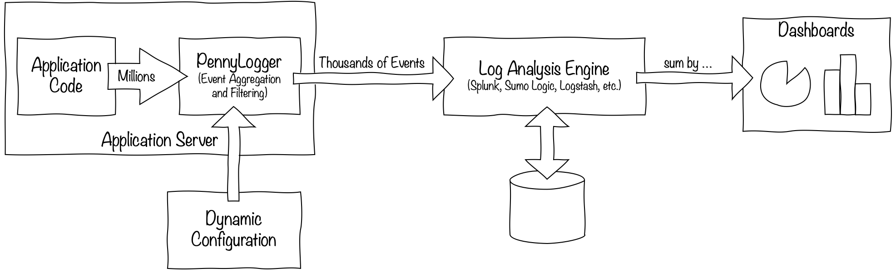

# PennyLogger

Log analysis tools such as Splunk, Sumo Logic, or Logstash are critical for monitoring modern cloud applications, but
the costs of processing millions and billions of log events can become prohibitively expensive. PennyLogger is a .NET
Standard library that offloads the first level of event aggregation and filtering to the application itself, enabling
events to be logged at a fraction of the usual costs.




## Getting Started

PennyLogger supports the ASP.NET Core model for dependency injection and logs its output to the standard `ILogger`
interface. To get started, add the PennyLogger service to your application's service dependencies in `Startup.cs`:

```C#
    public void ConfigureServices(IServiceCollection services)
    {
        // ...
        services.AddPennyLogger();
        // ...
    }
```

Then, in your controller class, add `IPennyLogger` to the constructor's parameters:
```C#
public class SampleController : ControllerBase
{
    public SampleController(IPennyLogger logger)
    {
        Logger = logger;
    }

    private readonly IPennyLogger Logger;
```

Then, log events to PennyLogger using the `IPennyLogger.Event()` method:
```C#
        Logger.Event(new
        {
            Event = "MyEvent",
            Value = value
        });
```

By default, events are aggregated and written to the output log every 5 minutes. For instance, if in a 5-minute window,
three events are written to PennyLogger with the values 1, 5, and 10, the following aggregate log entry will be written
to the output `ILogger` interface (JSON formatted for clarity):

```JSON
{
    "Event": "MyEvent$",
    "Count": 3,
    "Value": {
        "Min": 1,
        "Max": 10,
        "Sum": 16
    }
}
```

Note the `$` appended to the event ID to distinguish aggregate events in the final output log.


## PennyLogger Events

Applications may send either anonymous objects to PennyLogger or create classes that define each event type. Explicit
classes are preferrable as they (1) allow the same event ID to be logged in multiple places in the code and (2) support
attributes that customize the default PennyLogger configuration for the event.


### Event Properties

All public fields and properties of the event object are aggregated and logged. PennyLogger supports the following
property types:

Data Type    | Numeric Aggregation | Enumerable Aggregation
------------ | ------------------- | ----------------------
`string`     |                     | X (D)
`enum`       |                     | X (D)
`int`        | X (D)               | X
`long`       | X (D)               | X
`uint`       | X (D)               | X
`ulong`      | X (D)               | X
`float`      | X (D)               | X
`double`     | X (D)               | X
`decimal`    | X (D)               | X
`bool`       |                     | X (D)
`Type`       |                     | X (D)
`Guid`       |                     | X (D)

PennyLogger supports two aggregation modes, numeric and enumerable. (More on this below)
In the table above, (D) indicates the default behavior if no explicit configuration for the property is specified.


### Event IDs

Each event type must have a unique Event ID string. The ID may be specified one of four ways:

1. By including a string property named `Event` on the object.
2. By passing an ID in the `options` parameter to `IPennyLogger.Event()`, i.e.
    `Logger.Event(e, new PennyEventOptions { Id = "MyEvent" })`.
3. By specifying an ID as a class attribute, i.e. `[PennyEvent(Id = "MyEvent")]`.
4. If none of the above are specified, PennyLogger will use the class's name as the EventID, minus any "-Event" suffix,
    i.e. `class SampleEvent` will become `"Event": "Sample"` and `class SampleEntry` will become `"Event": "SampleEntry"`.


### Numeric Aggregation Mode

The default behavior for numeric property types is to aggregate the values and log the minimum, maximum, and sum of the
values, for instance:

```JSON
{
    "Event": "MyEvent$",
    "Count": 3,
    "Value": {
        "Min": 1,
        "Max": 10,
        "Sum": 16
    }
}
```

This format allows statistics to be easily computed across aggregate events.

#### Count

To count the total number of events across multiple aggregate log entries, sum the values of the `Count` property.

Splunk syntax:
```
index=my_app Event="MyEvent$"
| stats sum(Count)
```

SumoLogic syntax:
```
_collector=my_app
| where event = "MyEvent$"
| sum(count)
```

#### Average

To compute the average value across all aggregate log events, sum the values of `Count` and `Value.Sum` and divide.

Splunk syntax:
```
index=my_app Event="MyEvent$"
| stats sum(Count) as _count, sum(Value.Sum) as _sum
| eval _avg=_sum/_count
```

SumoLogic syntax:
```
_collector=my_app
| where event = "MyEvent$"
| sum(count) as _count, sum(%"value.sum") as _sum
| (_sum / _count) as _avg
```

#### Minimum

To compute the minimum value across all aggregate log events, take the minimum of `Value.Min`.

Splunk syntax:
```
index=my_app Event="MyEvent$"
| stats min(Value.Min)
```

SumoLogic syntax:
```
_collector=my_app
| where event = "MyEvent$"
| min(%"value.min")
```

#### Maximum

To compute the maximum value across all aggregate log events, take the maximum of `Value.Max`.

Splunk syntax:
```
index=my_app Event="MyEvent$"
| stats max(Value.Max)
```

SumoLogic syntax:
```
_collector=my_app
| where event = "MyEvent$"
| max(%"value.max")
```


### Enumerable Aggregation Mode

Enumerable aggregation is the default for non-numeric types and can be enabled for numeric data types using the
`PennyPropertyEnumerable` attribute:

```C#
class HttpRequestEvent
{
    [PennyPropertyEnumerable]
    public int StatusCode { get; set; }
}
```

Enumerable aggregation logs the Top-N values to the aggregate log event, for instance:

```JSON
{
    "Event": "HttpRequest$",
    "Count": 100,
    "StatusCode": {
        "200": 90,
        "404": 7,
        "500": 3
    }
}
```


#### Top-N Approximation

Tracking the Top-N values of a property could potentially result in unbounded memory consumption, as every value must
be counted, even if it only occurs once. To avoid this, PennyLogger approximates the Top-N whenever the number of
unique values grows above N*2 by using a probabilistic data structure known as a
[cuckoo filter](https://en.wikipedia.org/wiki/Cuckoo_filter). The memory for this filter is limited to 128 KB per
property, which produces very accurate approximations for most use cases. However, this behavior may be customized
using attributes.

To increase the memory limit to 1 MB:
```C#
    [PennyPropertyEnumerable(MaxMemory = 1048576)]
    public int StatusCode { get; set; }
```

Or to completely disable approximation:
```C#
    [PennyPropertyEnumerable(Approximate = false)]
    public int StatusCode { get; set; }
```

## Logging Raw Events

By default, PennyLogger only logs aggregate events to the output logs, however this may be changed by adding the
`[PennyEventRawLogging]` attribute to the event. To output the first 5 raw events per minute:

```C#
[PennyEventRawLogging(Max = 5, Interval = 60)]
class HttpRequestEvent
{
```

To enable both raw and aggregate logging of a single event, combine multiple attributes:

```C#
[PennyEventAggregateLogging(Interval = 300)]
[PennyEventRawLogging(Max = 5, Interval = 60)]
class HttpRequestEvent
{
```


## Samplers

An alternative way to log events with PennyLogger is using samplers. Rather than sending event objects to PennyLogger,
the application can register a lambda function or event to sample on a regular interval.

Consider a controller that contains a `Dictionary`, PennyLogger could log the count of the dictionary every 5 minutes:
```C#
public class SampleController : ControllerBase
{
    public SampleController(IPennyLogger logger)
    {
        Logger = logger;
        Table = new Dictionary<string, string>();
        TableSampler = Logger.Sample(() => new { Event = "TableSize", Count = Table.Count });
    }

    private readonly IPennyLogger Logger;
    private readonly Dictionary<string, string> Table;
    private readonly IDisposable TableSampler;
```

To customize the polling interval, use a named class with the `[PennySampler]` attribute, or specify the interval as a
parameter to `IPennyLogger.Sample()`:

```C#
[PennySampler(Interval = 60)]
class TableSizeSampler
{
```

```C#
        TableSampler = Logger.Sample(
            () => new { Count = Table.Count }
            new PennySamplerOptions { Id = "TableSize", Interval = 60 });
```


## Dynamic Configuration

An important feature of PennyLogger is that configuration may be changed at runtime. An initial set of options may be
configured on the events using attributes, but if later on, more detailed logging needs to be enabled to troubleshoot
an issue, then the settings may be changed at runtime using `appsettings.json` or Azure App Configuration.

When reading configuration, PennyLogger checks the following in order of lowest- to highest-priority:

1. Attributes on the event and sampler classes.
2. `options` parameter on `IPennyLogger.Event()` and `IPennyLogger.Sample()`.
3. `IOptions` via `appsettings.json` or [Azure App Configuration](https://docs.microsoft.com/en-us/azure/azure-app-configuration/enable-dynamic-configuration-aspnet-core)


## License
Copyright (c) 2017-2021 [Leo C. Singleton IV](https://www.leosingleton.com/).
This software is licensed under the MIT License.
